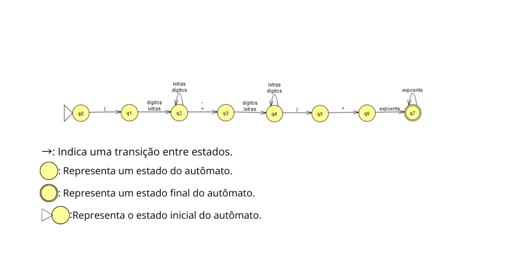
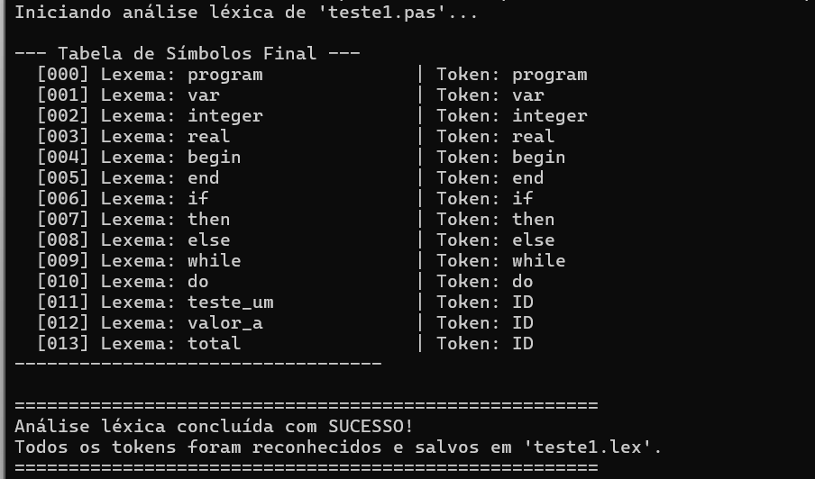
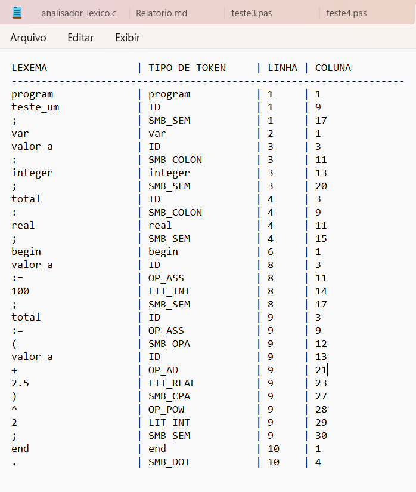
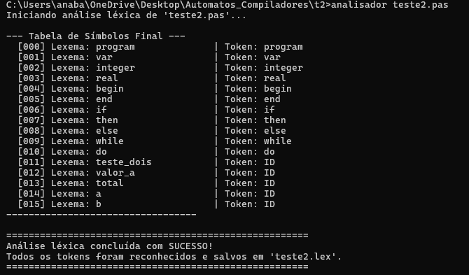
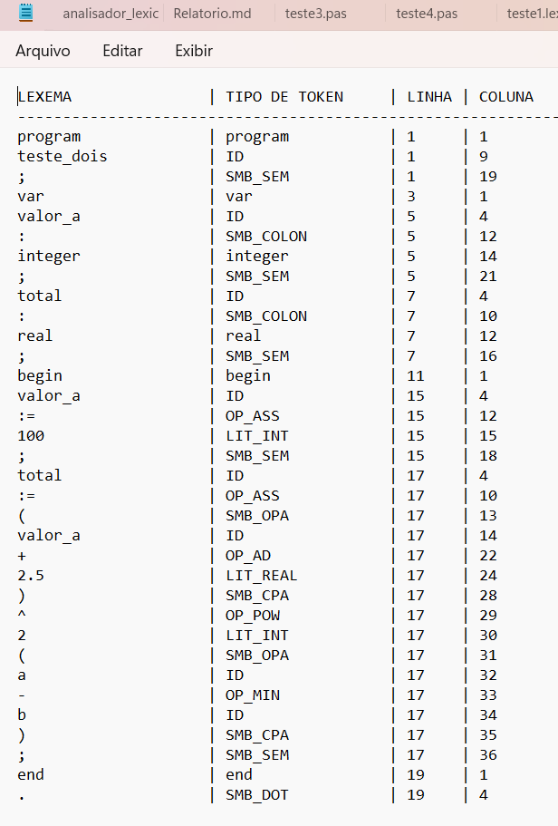
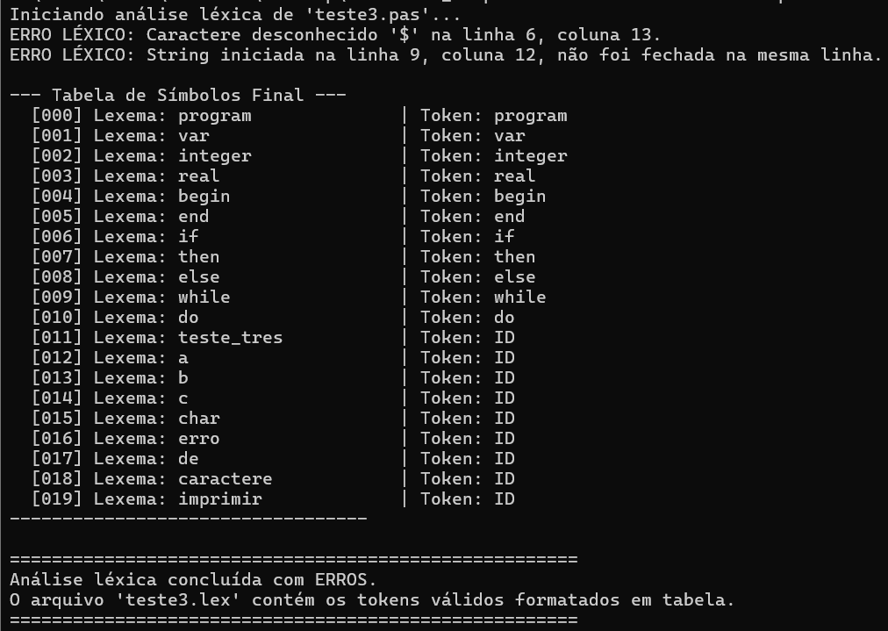
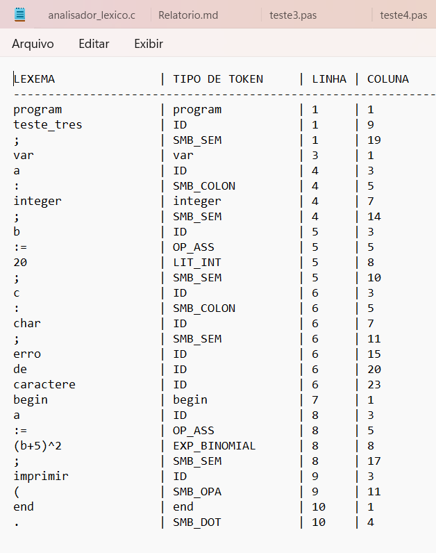
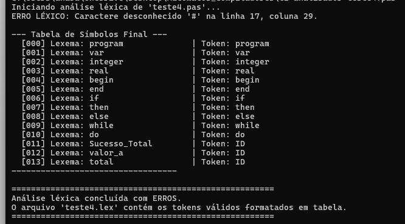
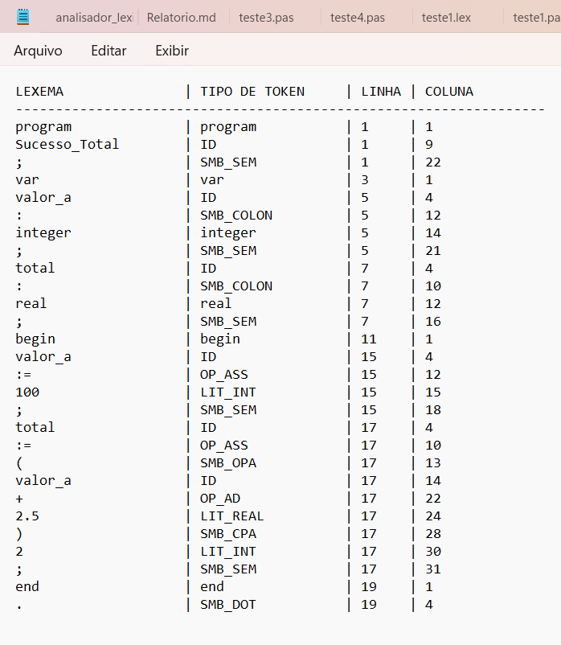

<h1 align="center">📑 Relatório Técnico Completo: Analisador Léxico para MicroPascal</h1>
<p align="center">
  
</p>

**Projeto:** Compilador Léxico para a linguagem MicroPascal\
**Matéria:** Linguagens Formais, Autômatos e Compiladores\
**Professor:** Marcelo Eustáquio\
**Curso:** 4º Semestre de Ciência da Computação\
**Alunos:** Ana Beatriz Gonçalves Bastos, Brenda Mykaelle da Mota Brito, Gabriel Bocacio Linder, Giovana Pacheco Velasco e Arthur Carvalho Feitosa Santana de Azevedo\
**Data da Versão:** 25 de setembro de 2025

------------------------------------------------------------------------

## 📋 Índice

1.  [**Objetivo do Projeto**](#-1-objetivo-do-projeto)
2.  [**Requisitos do Projeto: Limitações do MicroPascal**](#-2-requisitos-do-projeto-limitações-do-micropascal)
    * [2.1. Palavras-chave são reservadas](#21-palavras-chave-são-reservadas)
    * [2.2. Toda variável deve ser declarada antes do uso](#22-toda-variável-deve-ser-declarada-antes-do-uso)
    * [2.3. Comentários não permitidos](#23-comentários-não-permitidos)
    * [2.4. Comandos seguem semântica tradicional do Pascal](#24-comandos-seguem-semântica-tradicional-do-pascal)
    * [2.5. Linguagem não é case-sensitive](#25-linguagem-não-é-case-sensitive)
3.  [**Requisitos do Código estabelecidos do enunciado**](#-3-requisitos-do-código-estabelecidos-do-enunciado)
    * [3.1. Gera `.lex` com tokens + Linhas e Colunas](#31-gera-lex-com-tokens--linhas-e-colunas)
    * [3.2. Exibe tabela de símbolos](#32-exibe-tabela-de-símbolos)
    * [3.3. Ignorando Espaços](#33-ignorando-espaços)
    * [3.4. Ignorando Comentários](#34-ignorando-comentários)
    * [3.5. Reporta erros léxicos](#35-reporta-erros-léxicos)
4.  [**O Autômato Finito Determinístico (AFD) em Detalhes**](#-4-o-autômato-finito-determinístico-afd-em-detalhes)
    * [4.1. Autômato Finito Determinístico (AFD)](#41-autômato-finito-determinístico-afd)
    * [4.2. AFD Geral](#42-afd-geral)
    * [4.3. AFD Específico para Expressões Binomiais](#43-afd-específico-para-expressões-binomiais)
    * [4.4. O Alfabeto (Σ): Os Caracteres Permitidos](#44-o-alfabeto-σ-os-caracteres-permitidos)
    * [4.5. A Lógica de Transição e o Estado de Aceitação](#45-a-lógica-de-transição-e-o-estado-de-aceitação)
5.  [**Implementação em C**](#-5-implementação-em-c)
    * [Estruturas de Dados: `enum` e `structs`](#estruturas-de-dados-enum-e-structs)
    * [Detalhamento das Funções](#detalhamento-das-funções)
    * [Tratamento de Erros Léxicos](#tratamento-de-erros-léxicos)
6.  [**Testes em MicroPascal**](#-6-testes-em-micropascal)
    * [Teste 1: Todos os Tokens passaram como reconhecidos na Análise_Léxica!](#teste-1-todos-os-tokens-passaram-como-reconhecidos-na-análise_léxica)
    * [Teste 2: O que é reconhecido por padrão na Linguagem pascal!](#teste-2-o-que-é-reconhecido-por-padrão-na-linguagem-pascal)
    * [Teste 3: Identificando Erros e partes Corretas!](#teste-3-identificando-erros-e-partes-corretas)
    * [Teste 4(Extra): Erro com Token que não faz parte do Alfabeto](#teste-4extra-erro-com-token-que-não-faz-parte-do-alfabeto)
7.  [**Bibliotecas Utilizadas**](#-7-bibliotecas-utilizadas)
8.  [**Expressões Binominais e Reconhecimento Semântico Futuro**](#-8-expressões-binominais-e-reconhecimento-semântico-futuro)
    * [8.1. Fundamentos Matemáticos](#81-fundamentos-matemáticos)
    * [8.2. Etapa 1: A Análise Léxica (O Reconhecimento do Padrão)](#82-etapa-1-a-análise-léxica-o-reconhecimento-do-padrão)
    * [8.3. Etapa 2: A Análise Semântica (Objetivo Futuro do Projeto)](#83-etapa-2-a-análise-semântica-objetivo-futuro-do-projeto)
9.  [**Compilação e Execução**](#-9-compilação-e-execução)
* [**Anexo: Código-Fonte Completo**](#-anexo-código-fonte-completo-mainc)

------------------------------------------------------------------------


## 🔹 1. Objetivo do Projeto

O objetivo deste projeto é construir a primeira e mais fundamental parte de um compilador, o Analisador Léxico. A sua função é ler um código-fonte escrito em "MicroPascal" e traduzir esse texto complexo em uma sequência de "blocos" simples e categorizados, chamados tokens, inicando linha, coluna, lexema, tipo do token e possíveis erros no reconhecimento do Alfabeto Léxico. Este processo é a base para que o computador possa, nas etapas seguintes, entender a gramática e o significado do código.

Uma característica central deste projeto é a implementação de um reconhecedor específico para expressões de expansão binomial (ex: (`(a+b)^n`), tratando-as como um único bloco lógico.

> ✨ Com isso, temos o intuito de projetar um Código com capacidade de receber implementações em futuras fases, como Análise Semântica! Será um **reconhecedor para
> expressões binomiais** como `(a+b)^n`, que no futuro será expandido
> semanticamente usando resoluões baseadas no método teórico **Triângulo de Pascal**!

------------------------------------------------------------------------

## 🔹 2. Requisitos do Projeto: Limitações do MicroPascal

### 2.1. Palavras-chave são reservadas

``` c
// Exemplo simplificado
if (strcasecmp(tabela_de_simbolos[i].lexema, lexema) == 0) {
    return TOKEN_KEY_PROGRAM;
}
```

-   `inicializarTabelaDeSimbolos()` carrega as palavras-chave
    (`program`, `var`, `if` etc.)\
-   O usuário **não pode declarar variáveis** com nomes reservados

> ➡️ Quando o analisador encontra uma palavra, a função consultarOuInserirSimbolo() primeiro procura na iniciaçização da tabela se a palavra já existe. Como as palavras-chave já estão lá, elas serão encontradas e o token correto (TOKEN_KEY_IF, por exemplo) será retornado. A palavra nunca será classificada como um TOKEN_ID. Isso impede que um usuário declare uma variável com o nome var ou begin.

------------------------------------------------------------------------

### 2.2. Toda variável deve ser declarada antes do uso

- Esta é uma Regra **semântica**, não léxica.  
- O léxico apenas marca um identificador como `TOKEN_ID`.  
- A verificação semântica virá depois.  

O trabalho do nosso Analisador Léxico é apenas identificar que uma palavra como `minhaVariavel` é um identificador (`TOKEN_ID`).  
Ele não tem como saber se ela foi declarada ou não, pois não entende a estrutura de blocos `var` ou o conceito de "uso".  

> ➡️ O que nosso código faz é preparar o caminho. Ao identificar todos os IDs e colocá-los na Tabela de Símbolos, ele fornece a ferramenta necessária para que a próxima fase do compilador (o **Analisador Semântico**) possa fazer essa verificação.

------------------------------------------------------------------------

### 2.3. Comentários não permitidos

``` c
if (c == '{') {
    // ... comentário ...
    continue; // ignora o conteúdo
}
```

-   O compilador ignora blocos `{ ... }`
-   Comentários não são tokens
- O bloco de código abaixo, em `obterProximoToken`, encontra um {, consome tudo até encontrar um }, e então usa continue para pular para a próxima iteração do laço, efetivamente descartando o comentário.


------------------------------------------------------------------------

### 2.4 Comandos seguem semântica tradicional do Pascal

-   `:=` (atribuição) é diferente de `=` (comparação)\
-   Operadores relacionais como `<`, `<=`, `>=`, `<>` são reconhecidos


##### Atribuição (:=) vs. Comparação (=)

\
Uma das características mais marcantes do Pascal é a distinção clara entre o operador de atribuição (:=) e o de comparação (=), implementamos o (lookahead).

```c
// Bloco que trata a comparação simples, que não tem variações
if (c == '=') return criarToken(TOKEN_OP_EQ, "=", linha_inicio, coluna_inicio);

// Bloco que diferencia a atribuição do símbolo de dois-pontos
switch(c) {
    case ':':
        // Olha o próximo caractere sem avançar no arquivo
        if (preverCaractere() == '=') {
            proximoCaractere(); // Avança para "consumir" o '='.
            return criarToken(TOKEN_OP_ASS, ":=", linha_inicio, coluna_inicio);
        } else {
            // Se não for '=', é apenas o símbolo de dois-pontos
            return criarToken(TOKEN_SMB_COLON, ":", linha_inicio, coluna_inicio);
        }
}
```

###### _Semântica Pascal_

 Em Pascal, `variavel := 10` armazena um valor, enquanto `if variavel = 10 then` compara valores. A sintaxe é rígida e não permite ambiguidade.

O analisador construído garante essa regra na função `obterProximoToken`. Ao encontrar o caractere `:`, ele não assume o token imediatamente.

A função `preverCaractere()` é usada para "espiar" o caractere seguinte. Se for um `=`, o analisador os consome juntos, formando o token de atribuição `TOKEN_OP_ASS`.

Se o caractere seguinte não for um `=`, ele é tratado como um simples `TOKEN_SMB_COLON` (usado na declaração de variáveis, como `x : integer`). O operador `=` isolado é sempre tratado como `TOKEN_OP_EQ` (comparação).

---

#### Reconhecimento de Operadores Relacionais

A linguagem Pascal utiliza operadores de múltiplos caracteres como `<>` (diferente), `<=` (menor ou igual) e `>=` (maior ou igual). O analisador precisa reconhecê-los como uma unidade, e não como símbolos separados.

```c
if (c == '<') {
    if (preverCaractere() == '>') { proximoCaractere(); return criarToken(TOKEN_OP_NE, "<>", linha_inicio, coluna_inicio); }
    if (preverCaractere() == '=') { proximoCaractere(); return criarToken(TOKEN_OP_LE, "<=", linha_inicio, coluna_inicio); }
    return criarToken(TOKEN_OP_LT, "<", linha_inicio, coluna_inicio);
}

if (c == '>') {
    if (preverCaractere() == '=') { proximoCaractere(); return criarToken(TOKEN_OP_GE, ">=", linha_inicio, coluna_inicio); }
    return criarToken(TOKEN_OP_GT, ">", linha_inicio, coluna_inicio);
}
```

###### _Semântica Pascal_

 Expressões como `while i <= 10 do` ou `if x <> y then` são fundamentais para o controle da lógica de repetição do código.

O analisador aplica a regra do "maior casamento possível" (*maximal munch*). Ao ler um `<`, ele primeiro verifica se o próximo caractere é `>` (formando `<>`) ou `=` (formando `<=`).

Apenas se nenhuma dessas combinações for encontrada, ele considera o lexema como o operador simples `<`.

Essa abordagem impede que uma expressão como `<>` seja erroneamente tokenizada como dois tokens separados (`TOKEN_OP_LT` e `TOKEN_OP_GT`), o que causaria um erro de sintaxe na próxima fase da compilação.

---

#### Distinção entre Palavras-Chave e Identificadores

Palavras como `begin`, `end`, `if`, `while` têm um significado estrutural fixo(são as palavras reservadas no MicroPascal) e não podem ser usadas como nomes de variáveis. O analisador distingue essas palavras reservadas de identificadores definidos pelo usuário através de uma _Tabela de Símbolos_.

```c
// As palavras-chave são carregadas na Tabela de Símbolos
void inicializarTabelaDeSimbolos() {
    strcpy(tabela_de_simbolos[contador_tabela_simbolos].lexema, "program"); tabela_de_simbolos[contador_tabela_simbolos++].tipo = TOKEN_KEY_PROGRAM;
    strcpy(tabela_de_simbolos[contador_tabela_simbolos].lexema, "begin");   tabela_de_simbolos[contador_tabela_simbolos++].tipo = TOKEN_KEY_BEGIN;
    strcpy(tabela_de_simbolos[contador_tabela_simbolos].lexema, "end");     tabela_de_simbolos[contador_tabela_simbolos++].tipo = TOKEN_KEY_END;
    // ...
}

// Cada palavra encontrada é verificada na tabela
TipoToken consultarOuInserirSimbolo(const char* lexema) {
    // Procura na tabela se o lexema já existe (como uma palavra-chave).
    for (int i = 0; i < contador_tabela_simbolos; i++) {
        if (strcasecmp(tabela_de_simbolos[i].lexema, lexema) == 0) {
            return tabela_de_simbolos[i].tipo; // Se encontrou, retorna que é uma palavra-chave.
        }
    }
    // Se não encontrou, é um novo identificador
    strcpy(tabela_de_simbolos[contador_tabela_simbolos].lexema, lexema);
    tabela_de_simbolos[contador_tabela_simbolos].tipo = TOKEN_ID;
    contador_tabela_simbolos++;
    return TOKEN_ID; // Retorna que é um identificador
}
```

###### _Semântica Pascal_
 A estrutura de um programa Pascal é definida por suas palavras-chave. `program`, `var`, `begin`, `end`, `if`, `then`, `else`, `while`, `do` são a espinha dorsal da linguagem.

O processo ocorre em duas fases:

- **Pré-carregamento:** A função `inicializarTabelaDeSimbolos` atua como um dicionário, pré-populando a tabela com todas as palavras reservadas e seus tokens correspondentes (ex: `"begin"` -> `TOKEN_KEY_BEGIN`).

- **Verificação:** Quando o analisador lê uma sequência de letras (ex: `"soma"` ou `"begin"`), ele chama `consultarOuInserirSimbolo`. Esta função primeiro busca o lexema na tabela. Se o encontra, retorna o token de palavra-chave correspondente. Se não encontra, classifica-o como um `TOKEN_ID` (identificador) e o adiciona à tabela para referência futura.


------------------------------------------------------------------------

### 2.5. Linguagem **não é case-sensitive**

A função `strcasecmp` faz uma comparação de strings ignorando a diferença entre maiúsculas e minúsculas. Isso garante que `PROGRAM, program e ProGrAm` sejam todos reconhecidos como o mesmo token `TOKEN_KEY_PROGRAM`, e que as variáveis Valor e valor sejam tratadas como o mesmo identificador.

``` c
if (strcasecmp(tabela_de_simbolos[i].lexema, lexema) == 0) {
   // "program" == "PROGRAM" == "ProGrAm"
}
```

------------------------------------------------------------------------

## 🔹 3. Requisitos do Código estabelecidos do enunciado

Gera `.lex` com tokens ✔️ 
Exibe tabela de símbolos ✔️ 
Mostra linha e coluna ✔️ 
Reporta erros léxicos ✔️ 
Ignora espaços e comentários ✔️ 

### 3.1. Gera `.lex` com tokens + Linhas e Colunas

**O bloco de código responsável por isso está dentro do laço do-while da função main(). Note como as variáveis token.linha e token.coluna são usadas na chamada `fprintf`**

``` c
// Dentro do laço do-while na função main()
do {
    token = obterProximoToken();
    if (token.tipo == TOKEN_ERRO) {
        contem_erros = true;
    } else if (token.tipo != TOKEN_FIM_DE_ARQUIVO) {
        
        // Linha responsável por escrever cada linha da tabela no arquivo .lex
        fprintf(arquivo_saida, "%-20s | %-17s | %-5d | %d\n", 
                token.lexema, 
                tipo_token_para_string[token.tipo], 
                token.linha, 
                token.coluna);
    }
} while (token.tipo != TOKEN_FIM_DE_ARQUIVO);
```

### 3.2. Exibe tabela de símbolos

 **Primeiro ~ A função imprimirTabelaDeSimbolos(), que formata e imprime a tabela:**
``` c
void imprimirTabelaDeSimbolos() {
    printf("\n--- Tabela de Símbolos Final ---\n");
    for (int i = 0; i < contador_tabela_simbolos; i++) {
        printf("  [%03d] Lexema: %-20s | Token: %s\n", i, tabela_de_simbolos[i].lexema, tipo_token_para_string[tabela_de_simbolos[i].tipo]);
    }
    printf("----------------------------------\n");
}
```
**Depois ~ A chamada da função no final da main(), que garante que ela seja executada:**

``` c
// No final da função main()
    imprimirTabelaDeSimbolos();
    return 0;
}
```

### 3.3. Ignorando Espaços

``` c
while (isspace(c)) {
    continue; 
}
```

### 3.4. Ignorando Comentários

``` c
if (c == '{') {
    do {
        c = proximoCaractere();
        if (c == EOF) {
            // erro: comentário não fechado
        }
    } while (c != '}');
    continue;
}
```

### 3.5 Reporta erros léxicos

**Reconhecimento baseado na atividade proposta obtém três blocos de código dentro da função `obterProximoToken()` responsáveis por isso:**

~ 1. Erro de Caractere Desconhecido: (No final do switch)

``` c
default:
    sprintf(lexema, "%c", c);
    fprintf(stderr, "ERRO LÉXICO: Caractere desconhecido '%c' na linha %d, coluna %d.\n", c, linha_inicio, coluna_inicio);
    return criarToken(TOKEN_ERRO, lexema, linha_inicio, coluna_inicio);

```
~ 2. Erro de String Não-Fechada: (No bloco que trata o caractere ' )
``` c
if (c == '\'') {
    return criarToken(TOKEN_LIT_STRING, lexema, linha_inicio, coluna_inicio);
} else {
    fprintf(stderr, "ERRO LÉXICO: String iniciada na linha %d, coluna %d, não foi fechada na mesma linha.\n", linha_inicio, coluna_inicio);
    return criarToken(TOKEN_ERRO, lexema, linha_inicio, coluna_inicio);
}
```
~ 3. Erro de Comentário Não-Fechado: (No bloco que trata o caractere { )

``` c
do {
    c = proximoCaractere();
    if (c == EOF) {
        fprintf(stderr, "ERRO LÉXICO: Comentário iniciado na linha %d, coluna %d, não foi fechado antes do fim do arquivo.\n", linha_inicio_comentario, coluna_inicio_comentario);
        return criarToken(TOKEN_ERRO, "{...", linha_inicio_comentario, coluna_inicio_comentario);
    }
} while (c != '}');
```
------------------------------------------------------------------------

## 🔹 4. O Autômato Finito Determinístico (AFD) em Detalhes

O "cérebro" do nosso analisador é um Autômato Finito Determinístico (AFD). Ele lê um caractere de cada vez e, dependendo do caractere que lê e da regra que está ativa no momento, ela decide qual regra ativar em seguida, mudando assim seu estado de denifinição para true(aceito) ou false(não-aceito), conforme regras estebelecidas pelo Alfabeto do Analisador Léxico!

O alfabeto Σ da linguagem MicroPascal implementada é composto por:

* **Letras:** `a-z`, `A-Z` (usadas em identificadores e palavras-chave)
* **Dígitos:** `0-9` (usados em literais numéricos e identificadores)
* **Operadores Aritméticos:** `+`, `-`, `*`, `/`
* **Operador de Potência:** `^`
* **Operadores Relacionais:** `<`, `>`, `=` (que formam `<`, `<=`, `>`, `>=`, `=`, `<>`)
* **Símbolos de Atribuição:** `:` (que, combinado com `=`, forma `:=`)
* **Símbolos de Pontuação:** `,`, `;`, `.`
* **Delimitadores:** `(`, `)`
* **Delimitador de String:** `'`
* **Delimitadores de Comentário:** `{`, `}`
* **Caractere de Espaçamento:** Espaço, tabulação, quebra de linha (que são ignorados).
* **Caractere especial:** `_` (underscore, permitido em identificadores).

### 4.1. Autômato Finito Determinístico (AFD)

A lógica central do analisador é baseada em um Autômato Finito Determinístico (AFD), que define as regras de transição de estados com base no caractere lido.

### 4.2. AFD Geral

A função `obterProximoToken` implementa um AFD geral para a linguagem. O estado inicial é o início da função. A cada caractere lido, o autômato transita para um novo estado:
* Se lê um espaço, volta ao estado inicial (ignora).
* Se lê uma letra, transita para o estado de "reconhecimento de identificador/palavra-chave", onde permanece enquanto ler letras, dígitos ou `_`.
* Se lê um dígito, transita para o estado de "reconhecimento de número", onde pode eventualmente passar para um estado de "número real" se encontrar um `.`.
* Se lê um operador como `<`, transita para um estado que precisa "olhar à frente" (*lookahead*) para decidir se o token é `OP_LT` (`<`), `OP_LE` (`<=`) ou `OP_NE` (`<>`).
* Se lê um caractere inválido (que não pertence ao alfabeto), transita para um **estado de erro**, que reporta o problema e a localização.

### 4.3. AFD Específico para Expressões Binomiais

Para o requisito especial de reconhecer `(termo1 + termo2)^expoente` como um único token, um sub-AFD foi implementado. Ele é ativado quando o caractere `(` é encontrado.

**Lógica de Implementação:** A estratégia utilizada foi a de "tentativa e reversão" (*try and revert*). Ao encontrar `(`, o analisador salva sua posição no arquivo (`ftell`) e tenta validar a sequência completa da expressão binomial. Se qualquer passo falhar, ele reverte a leitura para a posição salva (`fseek`) e trata o `(` como um simples parêntese.

**Estados e Transições do AFD Binomial:**

* **p0 (Inicial):** O analisador está no estado inicial do AFD geral e lê o caractere `(`. Transita para **p1**.
* **p1 (Após `(`):** Espera o primeiro caractere de um termo (letra ou dígito). Se encontrar, consome o termo e transita para **p2**. Se não, falha.
* **p2 (Após Termo 1):** Espera um operador `+` ou `-`. Se encontrar, consome o operador e transita para **p3**. Se não, falha.
* **p3 (Após Operador):** Espera o primeiro caractere do segundo termo. Se encontrar, consome o termo e transita para **p4**. Se não, falha.
* **p4 (Após Termo 2):** Espera um `)`. Se encontrar, consome e transita para **p5**. Se não, falha.
* **p5 (Após `)`):** Espera um `^`. Se encontrar, consome e transita para **p6**. Se não, falha.
* **p6 (Após `^`):** Espera o primeiro dígito de um expoente. Se encontrar, consome o número inteiro e transita para **p7**. Se não, falha.
* **p7 (Estado de Aceitação):** O expoente foi lido com sucesso. A sequência completa foi validada. O lexema inteiro (ex: `(2x+y)^10`) é retornado como um único token `TOKEN_EXP_BINOMIAL`.



### 4.4. O Alfabeto (Σ): Os Caracteres Permitidos

O alfabeto é o conjunto de todos os símbolos que o nosso AFD tem permissão para ler.

* **Alfabeto Completo da Linguagem MicroPascal:** Inclui Letras, Dígitos, Underscore, Operadores (`+`, `-`, `*`, `/`, `^`, `=`, `<`, `>`), Pontuação (`:`, `;`, `,`, `.`, `(`, `)`) e Delimitadores (`'`, `{`, `}`).
* **Alfabeto Limitado da Expressão Binomial:** Para a tarefa de reconhecer `(a+b)^n`, o sub-autômato foca em um conjunto específico: **Σ_binomial = { Letras, Dígitos, `(`, `)`, `+`, `-`, `^` }**

### 4.5. A Lógica de Transição e o Estado de Aceitação

O AFD da expressão binomial segue uma série de estados (`p0` a `p7`). Cada estado tem o propósito de validar uma parte da expressão (início, termo 1, operador, etc.). O **Estado de Aceitação (`p7`)** é o objetivo final. Chegar a este estado significa que o padrão foi reconhecido com sucesso, e o token `TOKEN_EXP_BINOMIAL` é gerado. Se o padrão for quebrado antes de chegar a `p7`, o autômato não aceita, e o programa trata os caracteres como tokens separados.

| Estado Atual | Entrada                | Próximo Estado                      | Observação                                                |
| ------------ | ---------------------- | ----------------------------------- | --------------------------------------------------------- |
| **q0**       | `(`                    | **q1**                              | Ativação do sub-AFD ao detectar `(`                       |
| **q1**       | letra ou dígito        | **q2**                              | Início do Termo 1                                         |
| **q2**       | letra ou dígito        | **q2**                              | **LOOP 1**: consome todo o Termo 1                        |
| **q2**       | `+` ou `-`             | **q3**                              | Final do Termo 1, operador aritmético                     |
| **q3**       | letra ou dígito        | **q4**                              | Início do Termo 2                                         |
| **q4**       | letra ou dígito ou `.` | **q4**                              | **LOOP 2**: consome todo o Termo 2 (inclui números reais) |
| **q4**       | `)`                    | **q5**                              | Fechamento da expressão binomial                          |
| **q5**       | `^`                    | **q6**                              | Detecta operador de potência                              |
| **q6**       | dígito                 | **q7**                              | Início do expoente                                        |
| **q7**       | dígito                 | **q7**                              | **LOOP 3**: consome todos os dígitos do expoente          |
| **q7**       | qualquer outro símbolo | Aceita o token `TOKEN_EXP_BINOMIAL` | Estado final de aceitação                                 |


------------------------------------------------------------------------

## 🔹 5. Implementação em C

### Detalhamento Completo do Código-Fonte

#### Estruturas de Dados: `enum` e `structs`

##### `enum TipoToken`
- **Propósito:** Criar um conjunto de "rótulos" legíveis para cada categoria de token.
- **💡 Como Funciona:** O `enum` associa nomes a valores inteiros sequenciais. Ex.: `TOKEN_KEY_PROGRAM = 0`, `TOKEN_KEY_VAR = 1`.

<div align="center">
  
##### `struct Token`

<table>
  <tr>
    <th>Campo</th>
    <th>Descrição</th>
  </tr>
  <tr>
    <td><code>tipo</code></td>
    <td>Etiqueta `TipoToken` do token</td>
  </tr>
  <tr>
    <td><code>lexema</code></td>
    <td>Texto original do código-fonte</td>
  </tr>
  <tr>
    <td><code>linha</code></td>
    <td>Linha inicial do lexema</td>
  </tr>
  <tr>
    <td><code>coluna</code></td>
    <td>Coluna inicial do lexema</td>
  </tr>
</table>

</div>

- **Propósito:** Servir como uma ficha de identidade para cada token.

##### `struct EntradaTabelaSimbolos`
- **Propósito:** Representar uma entrada da Tabela de Símbolos.
- **💡 Como Funciona:** Armazena o `lexema` e sua etiqueta (`tipo`), garantindo organização.


#### Detalhamento das Funções

| Função | Propósito | Como Funciona | Quem Utiliza |
|--------|-----------|---------------|--------------|
| `inicializarTabelaDeSimbolos()` | Pré-carregar palavras-chave | Copia palavras como `"program"`, `"var"` e associa etiquetas | `main` |
| `consultarOuInserirSimbolo(const char* lexema)` | Gerenciar a Tabela de Símbolos | Procura ou adiciona novos identificadores e retorna a etiqueta | `obterProximoToken` |
| `imprimirTabelaDeSimbolos()` | Mostrar todas entradas da tabela | Percorre o array e imprime no terminal | `main` |
| `proximoCaractere()` | Avançar no arquivo | Lê e consome o próximo caractere, atualizando linha/coluna | `obterProximoToken` |
| `preverCaractere()` | Espiar próximo caractere | Lê o próximo caractere sem consumi-lo (`ungetc`) | `obterProximoToken` |
| `criarToken(...)` | Criar token pronto | Recebe tipo, lexema, linha, coluna e retorna a `struct Token` | `obterProximoToken` |
| `obterProximoToken()` | Reconhecer próximo token | Loop principal que descarta espaços/comentários, identifica e cria token | `main` |
| `main(...)` | Coordenar análise | Configura ambiente, abre arquivos, chama funções e gera relatórios | Sistema operacional |

---

#### Tratamento de Erros Léxicos

-  **Caractere inválido**
```c
default:
    fprintf(stderr, "ERRO LÉXICO: Caractere desconhecido '%c' na linha %d, coluna %d.\n",
            c, linha_inicio, coluna_inicio);
```

-  **String não fechada**
```c
if (c != '\'') {
    fprintf(stderr, "ERRO LÉXICO: String não fechada.\n");
}
```

-  **Comentário não fechado**
```c
if (c == EOF) {
    fprintf(stderr, "ERRO LÉXICO: Comentário não fechado.\n");
}
```


------------------------------------------------------------------------

## 🔹 6. Testes em MicroPascal

### Teste 1: Todos os Tokens passaram como reconhecidos na Análise_Léxica!

``` pascal
program teste_um;
var valor_a : integer; total : real;
begin
    { Este comentario sera ignorado }
    valor_a := 100;
    total := (valor_a + 2.5)^2;
end.
```

A regra de expansão binominal é que a e b devem fazer parte do conjunto de reais, ou seja, números negativos e decimais são possívels, no entanto, em nossa primeira análise léxica, o número 2.5 é decimal.

O AFD(junto do alfabeto definido começa a ler "2.5". Ele lê o 2, que é um dígito e está OK. Mas em seguida ele encontra o caractere . (ponto).

O ponto não é uma letra nem um dígito, então ele quebra a regra do nosso AFD especial. No momento em que o AFD encontrou o ponto, ele concluiu: "Este padrão não corresponde à expressão binomial que eu procuro."

Então, a lógica de falha e reversão ocorre. O analisador volta atrás e passa a tratar (valor_a + 2.5)^2 como uma sequência de tokens comuns, resultando na saída a seguir no arquivo.lex!

**Saída:**



------------------------------------------------------------------------

### Teste 2: O que é reconhecido por padrão na Linguagem pascal!

``` pascal
program teste_dois;
var
    valor_a : integer;
    total : real;
begin
    { Este comentario serIa ignorado }
    valor_a := 100;
    total := (valor_a + 2.5)^2(a-b);
end.
```
Aqui, não há erros léxicos, e sim erros Sintáticos, que serão complentados no futuro! A sequência `^2(a-b)` é sintaticamente incorreta em expressões binominais.

**Saída:**


------------------------------------------------------------------------

### Teste 3: Identificando Erros e partes Corretas!

``` pascal
program teste_tres;
var
    a : integer;
    b := 20; { erro de atribuição aqui, mas o léxico vê := }
    c : char; $ erro de caractere
begin
    a := (b + 5)^2;
    imprimir('teste de string... );
end.
```
O código indica quais caracteres apresentam-se como erro léxico e os demais não apontados são corretos!

Saída:



------------------------------------------------------------------------

### Teste 4(Extra): Erro com Token que não faz parte do Alfabeto

``` pascal
program Sucesso_Total;
var
    valor_a : integer;
    total : real;
begin
    { Este comentario sera ignorado }
    valor_a := 100;
    total := (valor_a + 2.5)#2;

end.
```

Aqui, há erro Léxico, # não faz parte do nosso alfabeto AFD!

Saída:




------------------------------------------------------------------------

## 🔹 7. Bibliotecas Utilizadas

-   `<stdio.h>` → entrada e saída padrão (printf, fprintf)
-   `<stdlib.h>` → alocação de memória e controle do programa
-   `<string.h>` → manipulação de strings (strcmp, strcpy, strcasecmp)
-   `<ctype.h>` → funções de classificação de caracteres (isalpha,
    isdigit, isspace)
-   `<stdbool.h>` → suporte ao tipo booleano (`true`, `false`)
-   `<locale.h>` → definição de localização/região, para corrigir acentuação gramatical
------------------------------------------------------------------------
## 🔹 8 Expressões Binominais e Reconhecimento Semântico Futuro

A funcionalidade mais distinta deste compilador é sua capacidade de interpretar e processar expansões binomiais. Este recurso demonstra a colaboração entre as duas fases primárias da compilação: a **Análise Léxica**, que reconhece a forma, e a **Análise Semântica**, que interpreta o significado e executa a lógica.

### 8.1. Fundamentos Matemáticos

[cite_start]As expressões binominais surgem da expansão de potências de binômios, que são expressões do tipo $(a+b)^n$[cite: 1]. [cite_start]Nesse formato, `a` e `b` podem ser números reais ou variáveis, e `n` é um número inteiro[cite: 1]. [cite_start]O estudo dessas expansões está diretamente ligado ao **Teorema Binomial de Newton**, uma fórmula que permite expandir sistematicamente qualquer potência de um binômio[cite: 1].

A forma geral do Teorema de Newton é dada por:
[cite_start]$$(a+b)^n = \sum_{k=0}^{n} \binom{n}{k} a^{n-k} b^k \text{[cite: 1]}$$

Onde os componentes da fórmula significam:
* [cite_start]**$\binom{n}{k}$**: É o **coeficiente binomial**, que determina o valor numérico que multiplica cada termo da expansão[cite: 1]. [cite_start]Ele é calculado pela fórmula $ \frac{n!}{k!(n-k)!} $[cite: 1].
* [cite_start]**$a^{n-k}$ e $b^k$**: Representam as potências dos termos `a` e `b`[cite: 1]. [cite_start]Note que, à medida que `k` aumenta, o expoente de `a` decresce, enquanto o de `b` cresce[cite: 1].
* [cite_start]**$\sum_{k=0}^{n}$**: Indica que devemos somar todos os termos gerados, variando o valor de `k` desde 0 até `n`[cite: 1].

[cite_start]Essa expansão é fundamental em diversas áreas da matemática e da computação, incluindo álgebra, combinatória, estatística e até em algoritmos de inteligência artificial[cite: 1].

### 8.2. Etapa 1: A Análise Léxica (O Reconhecimento do Padrão)

A fase léxica, já implementada neste projeto, atua como um **reconhecedor de padrões sintáticos**. Ela não compreende a matemática do Teorema Binomial; sua única responsabilidade é identificar se uma sequência de caracteres no código-fonte corresponde à *estrutura* de uma expressão binomial válida para o nosso escopo.

O Autômato Finito Determinístico (AFD) especializado que construímos valida a forma `(termo1 op termo2)^expoente`. Se a estrutura é validada, o analisador "empacota" a string inteira em um único token, `TOKEN_EXP_BINOMIAL`, passando a responsabilidade para a próxima fase.

### 8.3. Etapa 2: A Análise Semântica (Objetivo Futuro do Projeto)

Esta é a fase onde a "inteligência" do compilador interpretará o significado do token e aplicará a matemática. O objetivo é pegar o lexema e gerar sua forma expandida.

O fluxo de trabalho do Analisador Semântico será:

1.  **Extração dos Componentes:** Ao receber o token com o lexema `(2x+y)^2`, a primeira tarefa é extrair os valores concretos para os componentes da fórmula: `a = 2x`, `b = y`, e `n = 2`[cite: 1].

2.  **Cálculo dos Coeficientes:** Com o valor de `n` extraído, o analisador calculará os coeficientes binomiais $\binom{n}{k}$ para cada `k` de 0 a `n`[cite: 1]. Isso pode ser feito tanto pela fórmula fatorial quanto pela geração da linha `n` do Triângulo de Pascal, que é computacionalmente mais eficiente para valores de `n` não muito grandes.

3.  **Construção da Expansão:** O analisador irá iterar de `k=0` até `n=2`, construindo cada termo da expansão:
    * **k=0:** $\binom{2}{0} (2x)^{2-0} (y)^0 = 1 \cdot (4x^2) \cdot 1 = 4x^2$
    * **k=1:** $\binom{2}{1} (2x)^{2-1} (y)^1 = 2 \cdot (2x) \cdot y = 4xy$
    * **k=2:** $\binom{2}{2} (2x)^{2-2} (y)^2 = 1 \cdot 1 \cdot y^2 = y^2$

4.  **Geração da Saída:** O resultado final seria a representação do polinômio expandido: `4*x^2 + 4*x*y + y^2`.

#### Escopo do Projeto
É importante notar que o escopo deste compilador se limita a casos onde o expoente `n` é um **inteiro não negativo**. [cite_start]A fonte menciona que, para expoentes negativos ou fracionários, a expansão se torna uma série binomial infinita, válida apenas sob certas condições. O tratamento dessas séries generalizadas está fora do escopo do presente trabalho.

## 🔹 9. Compilação e Execução

``` bash
gcc -o analisador analisador.c
./analisador teste1.pas
```
## 📄 Anexo: Código-Fonte Completo (main.c)

 [`analisador_lexico.c`](./analisador_lexico.c)

------------------------------------------------------------------------
